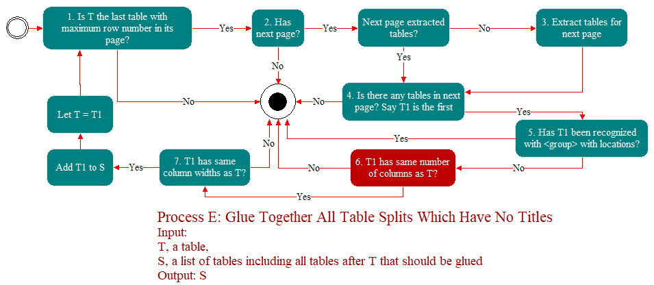
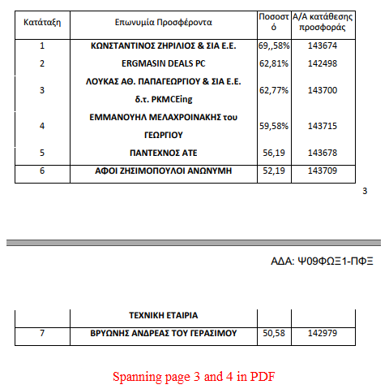
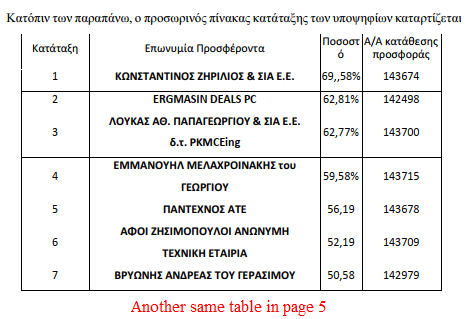
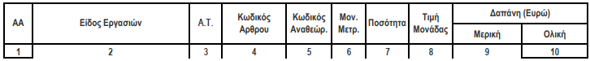
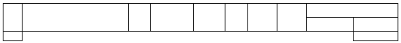
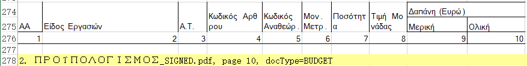

PDF is not in text format, rather it's in graphic format, more worsely there could be various possibilities of making objects invisible or being noisy, that leads to make invisible stuff show up or be perturbation in your final result like xlsx or docx etc, these factors include something like:

- white line
- characters in white
- covered/cropped by a shape
- annotations
- images
- forms
- etc.

So, it's very hard to extract tables with right lines and texts, there are lots of factors that may be noises for extracting clean tabular data and table.  I'm specialized in parsing PDF, partiularly in extracting tabular data, if you are interested, **YOU CAN FIND ME ON https://www.freelancer.com/search/users?online=true&q=eliuxj **, here just show you the most attractive features.

# Feature List

- Keep table layout as-is in Excel.
- Numbers are set numeric data type for analytics.
- Complicated table structure supported.
- Case insensitive in case of table selective extraction.
- Accent insensitive in case of table selective extraction, it's important for languages like Greek.
- Both containing operators and fuzzy comparing operators are used in recognizing tables with keywords, in case of fuzzy comparing typo is tolerated. In case of using containing operators, a given keyword doesn't have to appear as a word in target  text, can be part of a word in the target text. In case of using fuzzy comparing operator, a given keyword must be treated as words in target text.
- Glue tables that are spanning multiple pages.
- From a content perspective, de-duplicate same tables.
- Immune to latin characters, it's important for languages like Greek as it has many letters look like exactly the same as latin on the surface, but underlyingly encoded differently.
- Irregular table structure is tolerated.
- Cells are merged as-is in Excel.
- Text wrap is considered within cells.

# Example of Extract All Tables

Example, [PDF](2. ΠΡΟΥΠΟΛΟΓΙΣΜΟΣ_SIGNED.pdf), [XLSX](all.xlsx)

# Selective Extraction

There is no discriminations on tables if our goal is to extract ALL TABLES, just need to rule out something that's not tables, something looks like this:

But, the more challenging thing comes up when you want to selectively extract tables, what I did so far mainly by keywords with locations, currently there are three types of locations are supported: **ABOVE_TABLE, COLUMN_TITLE and IN_CELL**, and any combination of them are supported too, among them **COLUMN_TITLE** is widely used.

# Glue Table Split

In such a case of selective table extraction, the challenge is that, from a content perspective, the same table may span multiple pages in PDF, physically the first table in some page has column titles, but no titles for its followings that means they are ruled out in recoginzing tables with keywords having locations, I solved this by below process, it's not easy at all as a human can easily recognize in naked eyes:

Here is the real case when I was serving a customer in Greece,  [PDF](36-2020 Ψ09ΦΩΞ1-ΠΦΞ έγκριση πρακτικού Ι_signed.pdf), [Excel](glue.xlsx) where you can see Offer tables that span page 3 and 4 are glued together in the Excel, not missed out, although it's ruled out by searching keywords with locations (you may have noticed it has no titles).

# De-duplicate Tables

When selectively extracting tables, there may be two tables which are the same from a content perspective, say table T1 and T2, both T1 and T2 may span multiple pages or not. The challenge is we need to de-duplicate it, I solved this.

If you take a close look at the above PDF, it also has another Offer table in page 5, it has the same content as the above glued does, this one is not considered in the end as a result.

# Cells Compensation

The table of the last page of this [PDF](2. ΠΡΟΥΠΟΛΟΓΙΣΜΟΣ_SIGNED.pdf) has open bottom, looks like this:

In the begining, my table extracting engine recognizes it as:

Again, PDF is really in graphic format rather than text format, inside PDF format, there is no high level objects, like a table, no, not even a line.  But extracting tabular data is really based on extracting lines, then tables are recoginzed on top of extracted lines, so that's why my engine gives shuch a irregularly shaped table without cells compensation. 

My extracting engine ends up with below in Excel after cells compensation, meaning filling up all bottom border opened cells in [Excel](all.xlsx) if any content there.

The whole process of compensating is extremely complicated, think about this:

#1, Line 276 doesn't have to be really single row, internally it may be multiple rows, its cells may have multiple columns.

#2, We cannot immediately compensate open cells without considering anything else, that would lead to make some text as part of a table that shouldn't happen. For this reason, we need to look at its neighbors, in this case it is the lie 275 as reference to compare if they have similar structure and content distribution as described in #1, actually most of cells of line 275 are empty, inside my extracting engine, line 274 and 275 are covered by merged cells actually.

#3, Anyway it's just extremely sophisticated, you can try it yourself with some other tabular format data extracting tools with the same [PDF](2. ΠΡΟΥΠΟΛΟΓΙΣΜΟΣ_SIGNED.pdf).
